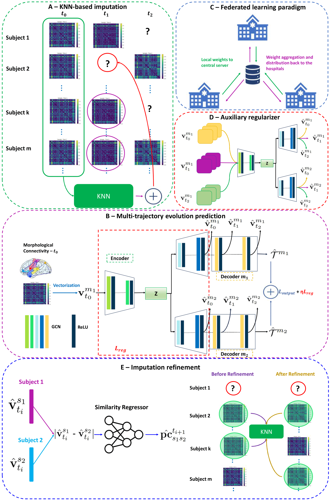

# FedGmTE-Net-plus
FedGmTE-Net-plus for predicting graph multi-trajectory evolution with the help of federated learning, coded up in Python by Michalis Pistos. Please contact michalis.pistos@gmail.com for inquiries. Thanks.



## Introduction

> **Predicting Infant Brain Connectivity with Federated Multi-Trajectory GNNs using Scarce Data**

> [Michalis Pistos](https://github.com/michalispistos)<sup>1</sup>, [Gang Li]<sup>2</sup>, [Weili Lin]<sup>2</sup>, [Dinggang Shen]<sup>3,4,5</sup>, [Islem Rekik](https://basira-lab.com/)<sup>1</sup>
>
> <sup>1</sup>BASIRA Lab, Imperial-X and Department of Computing, Imperial College London, London, UK
> <sup>2</sup>Department of Radiology and Biomedical Research Imaging Center, University of North Carolina at Chapel Hill, Chapel Hill, NC, USA
> <sup>3</sup>School of Biomedical Engineering, ShanghaiTech University, Shanghai 201210, China
> <sup>4</sup>Shanghai United Imaging Intelligence Co., Ltd., Shanghai 200230, China
> <sup>5</sup>Shanghai Clinical Research and Trial Center, Shanghai 201210, China
>
> **Abstract:** The understanding of the convoluted evolution of infant brain networks during the first postnatal year is pivotal for identifying the dynamics of early brain connectivity development. Thanks to the valuable insights into the brain's anatomy, existing deep learning frameworks focused on forecasting the brain evolution trajectory from a single baseline observation. While yielding remarkable results, they suffer from three major limitations. First, they lack the ability to generalize to multi-trajectory prediction tasks, where each graph trajectory corresponds to a particular imaging modality or connectivity type (e.g., T1-w MRI). Second, existing models require extensive training datasets to achieve satisfactory performance which are often challenging to obtain. Third, they do not efficiently utilize incomplete time series data. To address these limitations, we introduce FedGmTE-Net++, a federated graph-based multi-trajectory evolution network. Using the power of federation, we aggregate local learnings among diverse hospitals with limited datasets. As a result, we enhance the performance of each hospital's local generative model, while preserving data privacy. The three key innovations of FedGmTE-Net++ are: (i) presenting the first federated learning framework specifically designed for brain multi-trajectory evolution prediction in a data-scarce environment, (ii) incorporating an auxiliary regularizer in the local objective function to exploit all the longitudinal brain connectivity within the evolution trajectory and maximize data utilization, (iii) introducing a two-step imputation process, comprising a preliminary KNN-based precompletion followed by an imputation refinement step that employs regressors to improve similarity scores and refine imputations. Our comprehensive experimental results showed the outperformance of FedGmTE-Net++ in brain multi-trajectory prediction from a single baseline graph in comparison with benchmark methods.

## Installation
### *Anaconda Installattion*
* Go to https://repo.anaconda.com/archive/
* Download version for your system (We used Python 3.10.8 on 64-bit Windows 11)
* Install the platform
* Create a conda environment by typing:  ```conda create --name fedgmte-net-plus python=3.10.8 ```

### *Dependency Installattion*
Copy and paste the following command to install base packages:
```sh
$ conda activate fedgmte-net-plus
$ pip install numpy
$ pip install matplotlib
$ pip install scikit-learn
$ pip install pyyaml
$ pip install torch
```

## Running FedGmTE-Net-plus
We provide a demo code for the usage of FedGmTE-Net-plus for predicting multi-trajectory evolution of graphs from a single baseline graph.
In main.py we train our network on a simulated dataset: 100 subjects in total with a 4-fold cross-validation. We use 25 of the subjects for testing and 75 of the subjects for training (we have 3 hospitals with 25 subjects each). Each subject has brain graphs denoting two modalities (i.e., low-resolution and super-resolution brain graphs) acquired at 3 timepoints. The first one is used as a baseline to train the model and predict the evolution trajectory including the rest of the timepoints as well. The user can modify all the program arguments and select the specific testing environment. Some of the possible user options are listed below:

* Modes (methods): NoFedGmTE-Net, FedGmTE-Net, FedGmTE-Net+, FedGmTE-Net++
* Evaluation metrics: MAE(graph), MAE(NS), MAE(PC), MAE(JD)
* Data distributions: IID, non-IID (K-means split)
* Datasets: simulated dataset (100 subjects - 60% completed)

The user can also add hyper-parameters and vary their default values.

The user can run the code for training and testing with the following command:
```bash
python main.py
```

# Input and Output data
In order to use our framework, the user needs to provide a set of trajectories where a single trajectory represents a set of feature matrices acquired at multiple timepoints. A feature matrix is of size (n * d). We denote n the total number of subjects in the dataset and d the number of features extracted from the connectivity matrix. The user needs to make the appropriate changes in main.py and dataset.py to include their own data in a similar way as our simulated graphs. We note here that two feature matrices derived from two different trajecoties might have different number of features (i.e., super-resolution and low-resolution graphs). In that way, our code is generic and can be used for any type of isomorphic graph. In our example, for an input brain graph at t0 (35 x 35), our framework produces two trajectories each is a set of follow-up brain graphs  of a specific modality. The brain connectivity matrices of one modality have a size of 35 x 35 (morphological connectome) and for the second modality they have a size of 116 x 116 (functional connectome).

# Please Cite the Following paper when using our work:

@article{pistos2024predicting, <br/>
  title={Predicting Infant Brain Connectivity with Federated Multi-Trajectory GNNs using Scarce Data}, <br/>
  author={Pistos, Michalis and Rekik, Islem}, <br/>
  journal={arXiv preprint arXiv:2401.01383}, <br/>
  year={2024} <br/>
} <br/>
